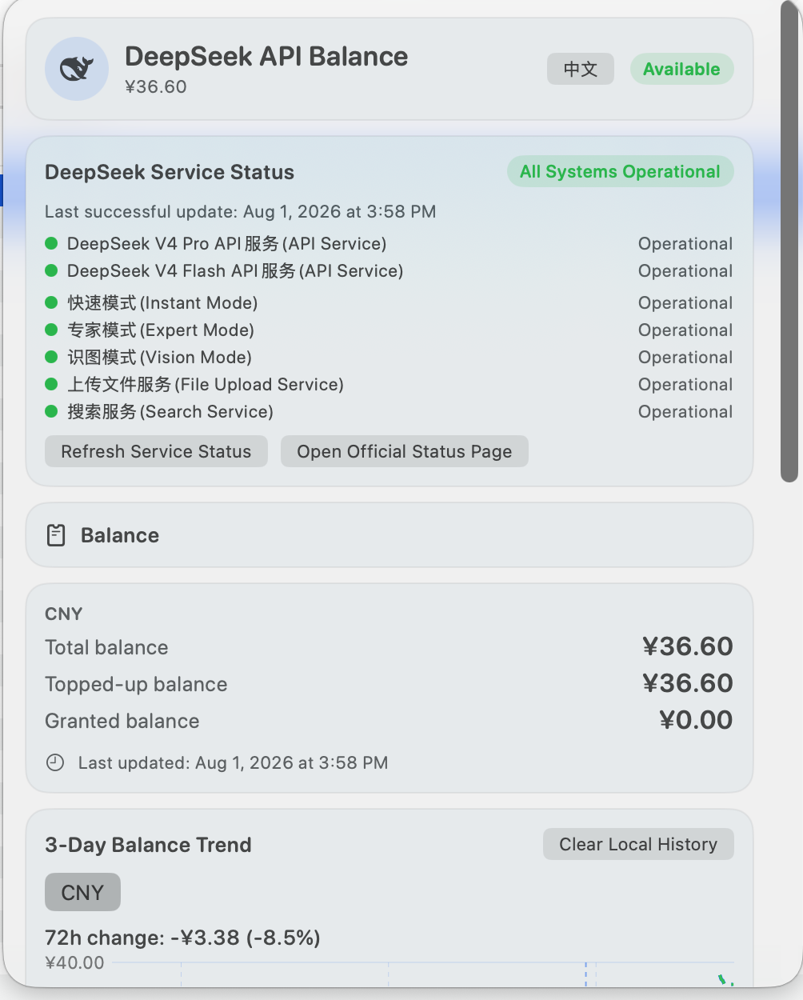

# DeepSeekBalance

[中文] | [English](README_EN.md)

纯 Swift 原生 macOS 菜单栏应用，实时显示 DeepSeek API 剩余余额，记录最近 3 天的余额变化趋势，并展示 DeepSeek 官方服务状态。常驻系统顶部菜单栏，不显示 Dock 图标。唯一第三方依赖为 Google LevelDB（Git submodule，见下文）。

## 界面截图

弹出窗口展示余额、官方服务状态和最近 3 天趋势：

<p align="center">
  
</p>

菜单栏显示单色图标和当前余额：

<p align="center">
  
</p>

## 功能简介

- 菜单栏同时显示单色 DeepSeek 图标和余额文字（如 `¥110.00`，多币种为 `¥110.00 · $2.50`）
- 左键点击菜单栏图标打开弹出窗口；右键点击显示包含「退出应用」的菜单
- 点击菜单栏项目弹出窗口，展示总余额、充值余额、赠送余额和最后更新时间
- 状态指示：可用 / 余额不足 / 未配置 / 请求失败 / Keychain 错误
- 支持在界面中把 API Key 保存到 macOS Keychain，或清除后回退到环境变量
- 启动自动刷新、每 5 分钟自动刷新、打开菜单时距上次成功超过 60 秒自动刷新
- 请求失败时保留上一次成功余额；认证失败或 Keychain 无法确认时清空旧账号显示，避免残留
- 最近 3 天余额趋势图（Apple Swift Charts，10 分钟时间桶采样，本地 LevelDB 存储）
- 趋势图支持鼠标点击/拖动选择样本，显示本地时间、各项余额与前一样本变化
- DeepSeek 官方服务状态卡片：整体状态、API Service、Web Chat Service、事故与计划维护
- 登录时启动（Launch at Login，基于 `SMAppService.mainApp`）
- 简体中文 / English 一键切换，立即生效，无需重启
- 使用 Swift Concurrency（`async/await` + `URLSession`）、AppKit `NSStatusItem` + SwiftUI `NSPopover`、Security.framework、CryptoKit、Charts、ServiceManagement

## 基础使用

1. 打开 [Releases](https://github.com/J-XZ/deepseek_status/releases) 下载最新版本。推荐使用 `.dmg`：双击打开后，将 `DeepSeekBalance.app` 拖入 `Applications`；也可以使用 `.pkg` 安装包或解压 `.zip` 后把 App 移到 `Applications`。
2. 从 `Applications` 启动 App。它不会显示 Dock 窗口，启动后请查看屏幕右上角菜单栏中的 DeepSeek 图标。
3. 点击菜单栏图标，在「设置 / Settings」的 API Key 区域输入 DeepSeek API Key 并保存。推荐保存到 macOS Keychain，这样从 Finder 双击启动时也能正常读取。
4. 保存密钥后，应用会自动获取余额和官方服务状态。点击菜单栏项目可以查看总余额、充值余额、赠送余额、更新时间和最近 3 天趋势；点击底部「刷新」可立即更新。
5. 在设置区可以切换中英文、开启登录时启动，以及清除本机保存的历史数据。

如果下载的是未签名 Release，首次启动时 macOS 可能提示无法验证开发者：在 Finder 中按住 Control 点击 App，选择「打开」，再确认一次即可。不要为了运行单个 App 而关闭系统级 Gatekeeper。

## 菜单栏余额

- 无 API Key 时菜单栏显示「未配置」，错误时显示「错误」，加载时显示「…」
- 金额符号由接口返回的币种决定：CNY → `¥`、USD → `$`、未知币种 → `EUR 10.00` 形式
- 数字分组、日期、时间与百分比使用当前界面语言对应的 Locale；切换语言立即生效

## 最近 3 天余额趋势

- DeepSeek 没有公开的历史余额 API，因此本应用在本地记录每次成功获取的余额样本。
- 历史以 **10 分钟 UTC 时间桶**保存：同一币种同一时间桶最多一条，桶内后一次成功刷新覆盖前一次；负 Unix 时间使用严格 floor。
- 当前余额查询频率保持原有设置（启动立即查询 + 每 5 分钟自动刷新）；5 分钟内的多次成功结果写入同一个 10 分钟桶。
- 历史只能从应用首次成功采样后开始；应用未运行期间不会产生数据；电脑睡眠期间会出现数据缺口（超过 20 分钟的缺口会在图表中断开连线，不插值）。
- 趋势图只使用 `LineMark` 绘制连续数据，不绘制容易造成视觉噪声的小圆点；数据缺口超过 20 分钟时断开连线，72 小时 10 分钟粒度（最多约 432 桶）下依然流畅。
- X 轴 domain 明确为 `now - 72 小时 ... now`，时间来源可注入。
- 历史只保存在本机，最多保留最近 72 小时；应用启动时执行一次清理（使用注入时钟），之后按节流策略清理（只有清理成功后才会记录节流时间，失败后下次可重试）。
- 数据库位置：`<Application Support>/com.jxz.deepseekbalance/BalanceHistory.leveldb`；升级时会兼容读取旧的 `com.example.DeepSeekBalance` 目录。
- 弹出页面提供「清除本地历史」按钮（带确认对话框），只清除当前账号对应的历史，不影响 API Key 与当前余额；清除后当前余额中真实存在的币种仍保留在币种选择器中。
- 币种选择器只显示当前余额响应与当前账号历史中真实存在的币种（CNY、USD 仅在真实存在时优先排序），不显示虚假选项。
- 趋势图按币种分别展示总余额、充值余额、赠送余额，支持浅色/深色模式。

## DeepSeek 官方服务状态

- 数据来源仅使用 DeepSeek 官方状态页的公开 JSON：`https://status.deepseek.com/api/status-page/6410630422455/summary/active`（官方状态页由 Flashcat 托管，页面 HTML 中公开的 `page_id` 为 `6410630422455`；标准 Statuspage 路径 `/api/v2/summary.json` 在该域名下返回 404，不使用）
- 官方状态页面：`https://status.deepseek.com/`
- 状态请求不需要 API Key，也不发送 `Authorization` 头；状态网络层与余额网络层相互独立，一个失败不影响另一个。
- 应用启动后立即获取官方状态；默认每 5 分钟刷新；弹出菜单打开时缓存超过 60 秒则刷新；app wake / didBecomeActive 后按缓存年龄刷新；提供独立「刷新服务状态」按钮；底部「刷新」并发刷新余额与官方状态，两者错误互不覆盖。
- 整体状态支持 `none / minor / major / critical / maintenance / unknown`；组件状态、事故阶段与影响范围支持 Statuspage 全部常见取值，未知值回退为 `unknown`，不会导致解码失败。
- 组件按名称识别并优先排序 API Service 与 Web Chat Service（不依赖固定组件 ID），其余官方组件按「其他组件」展示；component group 不重复展示。
- 状态语义严格区分「DeepSeek 服务异常」与「无法获取官方状态信息」：只有官方返回 `major_outage` / `critical` 才表示严重异常；状态接口超时或网络失败只显示「官方状态信息暂时不可用」。
- 有上一次成功数据时保留旧数据并标记「可能已过期」，同时显示上次成功更新时间；首次失败显示 Unknown/Unavailable，不伪造正常状态。
- 未解决事故显示标题、当前阶段、impact、最近更新时间和最新 update 的简短纯文本；计划维护单独列出。远程正文只作为纯文本展示（截断到合理长度），不解析 HTML、不执行 Markdown。
- 提供「打开官方状态页」按钮（`NSWorkspace.shared.open`）。

## 登录时启动

- 基于 Apple 原生 `ServiceManagement` 的 `SMAppService.mainApp`，不创建额外 helper app。
- 设置区提供「登录时启动 / Launch at Login」开关，并显示真实系统状态：已启用 / 未注册 / 需要批准 / 未找到 / 错误。
- 开启调用 `register()`，关闭调用 `unregister()`；已注册、已取消等状态按幂等成功处理；操作后重新读取真实 `SMAppService.mainApp.status`，不只更新本地 Bool。
- 用户拒绝或系统需要批准时显示 `requiresApproval`，并提供「打开登录项设置」按钮。
- app 变为活跃时重新读取真实状态，用户可能在系统设置中手动修改。
- 切换失败后 UI 回滚到真实系统状态并显示非敏感错误。

系统批准说明：从 Xcode 运行时使用自动签名的 Debug 构建可能无法注册登录项；真实注册要求应用正常签名并从合适位置运行。如果系统提示需要在「系统设置 → 通用 → 登录项」中批准，请点击「打开登录项设置」手动批准。单元测试全部使用 Fake LoginItemManager，不会修改真实登录项。

## 中英文一键切换

- 支持简体中文（`zh-Hans`）与 English（`en`）。
- 首次启动根据系统首选语言选择；系统语言不是中文时默认 English；用户选择持久化在 `UserDefaults`（仅语言偏好，API Key 仍只存 Keychain）。
- 标题区与设置区各有一个一键切换按钮：中文界面显示 `English`，英文界面显示 `中文`，点击一次立即切换，无需重启。
- 所有文本（菜单栏、状态徽章、错误、趋势、服务状态、登录项状态、日期/数字格式）由语义数据 + L10n 按当前语言即时渲染；状态层不保存翻译后的字符串。
- 已显示的错误在切换语言后立即变化，不需要重新请求。
- 本地化资源使用 Xcode String Catalog（`DeepSeekBalance/Resources/Localizable.xcstrings`），en 与 zh-Hans 全部 key 完整覆盖并有测试校验。

## 设置区

弹出页面的「设置 / Settings」区包含：

1. 语言：一键切换按钮
2. 登录时启动：开关 + 状态说明 + 需要批准时的「打开登录项设置」按钮
3. API Key：保留原有 Keychain 配置
4. 本地历史：保留「清除本地历史」按钮

窗口使用 ScrollView，宽度约 500 点，常见 MacBook 屏幕可以完整显示。

## LevelDB 集成（Git submodule）

LevelDB 是唯一的 C/C++ 第三方运行时依赖，通过 Git submodule 固定到明确 commit：

- submodule 路径：`Vendor/LevelDB`
- 仓库：https://github.com/google/leveldb
- Commit：`99b3c03b3284f5886f9ef9a4ef703d57373e61be`
- Tag：`1.23`

克隆仓库时：

```bash
git clone --recurse-submodules https://github.com/J-XZ/deepseek_status.git
```

已有 clone 初始化 submodule：

```bash
git submodule update --init --recursive
```

`build.sh` 会检查 submodule 状态：未初始化（`-`）、checkout 与仓库记录不一致（`+`）、冲突（`U`）都会给出提示并以非零状态退出，提示文本为 `请运行：git submodule update --init --recursive`，不会在普通构建中静默联网下载，也不会修改系统的 Xcode 选择。

LevelDB 许可证见 `THIRD_PARTY_NOTICES.md`。

## API Key 与 Keychain

### 配置 API Key 的两种方式

1. **应用界面（推荐）**：点击菜单栏图标，在弹出窗口的 API Key 区域输入密钥并点击「保存」。密钥会写入 macOS Keychain，输入框不会回显已保存的密钥。
2. **环境变量**：在启动应用的终端中先设置环境变量再运行：

```bash
export DEEPSEEK_API_KEY="sk-xxxxxxxx"
open /path/to/DeepSeekBalance.app
```

### 环境变量名称

- `DEEPSEEK_API_KEY`

### 优先级

1. Keychain 中保存的 API Key（最高优先级）
2. 环境变量 `DEEPSEEK_API_KEY`
3. 未配置

点击「清除已保存密钥」只会删除 Keychain 中的值；如果环境变量存在，应用会自动回退到环境变量并刷新余额。

Keychain 读取失败时：取消当前请求、清空当前余额、最后更新时间、credentialID、历史样本与币种选择，并显示 Keychain 错误，绝不继续显示旧账号趋势。

### Finder 启动与 shell 环境变量

macOS 从 Finder 启动 GUI 应用时，通常不会继承终端 shell 中设置的环境变量。因此如果通过 Finder 双击启动，环境变量可能读取不到。推荐通过应用界面把 API Key 保存到 Keychain，这样与启动方式无关。

## 本地构建与测试

Debug 构建：

```bash
./build.sh
```

Release 构建：

```bash
./build.sh --release
```

一键生成可分发安装包（ZIP、双击安装 PKG、拖拽安装 DMG，以及 SHA256SUMS）：

```bash
./build.sh --package
```

产物位于 `build/artifacts/`。未签名构建首次打开时，macOS 可能要求在“系统设置 → 隐私与安全性”中手动允许。

本地单元测试：

```bash
./build.sh --test
```

清理并构建 Debug：

```bash
./build.sh --clean
```

全流程（清理 + Debug + Release + 测试 + analyze）：

```bash
./build.sh --all
```

`--help` 返回 0；非法参数返回非零；`--all` 真实依次执行 clean、Debug build、Release build、全部单元测试与静态分析。

## GitHub Release

推送版本标签即可自动发布：

```bash
git tag v1.0.2
git push origin v1.0.2
```

`.github/workflows/release.yml` 会在 macOS runner 上初始化 LevelDB submodule、运行单元测试并把全部产物发布到对应的 GitHub Release。签名是可选的：

- 如果一个 Apple 签名 Secret 都没有，工作流发布未签名的 ZIP、PKG 和 DMG；用户首次启动时需要按上面的「基础使用」说明手动允许。
- 如果以下 Secrets 全部配置，工作流使用 Developer ID 签名并完成 notarization，用户通常可以直接双击启动。
- 如果只配置了一部分，工作流会直接失败并提示补齐，不会静默发布半配置产物。

要启用签名，请在仓库 Settings → Secrets and variables → Actions 中配置以下 Secrets：

- `APPLE_CERTIFICATE_P12_BASE64`：包含 Developer ID Application 和 Developer ID Installer 证书的 `.p12` 文件，经 Base64 编码后的内容。
- `APPLE_CERTIFICATE_PASSWORD`：导出 `.p12` 时设置的密码。
- `APPLE_KEYCHAIN_PASSWORD`：CI 临时钥匙串密码，可自行生成随机值。
- `APPLE_DEVELOPER_ID_APPLICATION`：完整证书名，例如 `Developer ID Application: Your Name (TEAMID)`。
- `APPLE_DEVELOPER_ID_INSTALLER`：完整证书名，例如 `Developer ID Installer: Your Name (TEAMID)`。
- `APPLE_TEAM_ID`：Apple Developer Team ID。
- `APPLE_ID`：用于 notarization 的 Apple 账号邮箱。
- `APPLE_APP_SPECIFIC_PASSWORD`：该 Apple 账号生成的 App 专用密码。

`.p12` 可从“钥匙串访问”中同时导出这两个 Developer ID 证书。`APPLE_APP_SPECIFIC_PASSWORD` 不是 Apple 账号登录密码。配置完成后重新推送一个新标签；已有的未签名 Release 不会被自动修复，需要重新构建并发布新版本。

本地仍可按原方式生成免签名包；如果已经在本机安装了证书，也可以设置 `CODE_SIGNING_ALLOWED=YES`、`CODE_SIGN_IDENTITY`、`DEVELOPMENT_TEAM` 后运行打包脚本。Apple notarization 使用 Xcode 自带的 `notarytool`，并把 ticket 固化到 App、PKG 和 DMG 中。

也可以直接使用 xcodebuild 构建与测试：

```bash
xcodebuild \
  -project DeepSeekBalance.xcodeproj \
  -scheme DeepSeekBalance \
  -destination 'platform=macOS' \
  CODE_SIGNING_ALLOWED=NO \
  test
```

静态分析：

```bash
xcodebuild \
  -project DeepSeekBalance.xcodeproj \
  -scheme DeepSeekBalance \
  -configuration Debug \
  -destination 'platform=macOS' \
  CODE_SIGNING_ALLOWED=NO \
  analyze
```

测试不访问真实 DeepSeek 余额 API、不访问真实状态页、不写入真实 Keychain、不修改真实登录项、不写生产 Application Support 数据库：网络请求通过自定义 `URLProtocol` 模拟，Keychain 通过内存 Fake 注入，LevelDB 测试使用临时目录，登录项使用 Fake LoginItemManager。覆盖余额解析、鉴权头、状态码、超时、格式化、密钥优先级、凭据隔离、时间桶、LevelDB 失败路径与 iterator 错误、prune 节流、趋势模型、生命周期观察者释放、官方状态客户端/Store、登录项状态机与本地化完整性等场景。

## 系统要求

- macOS 13 或更高版本
- Xcode 15 或更高版本（本工程在 Xcode 26.6 下验证构建与测试通过）

## 如何运行

1. 打开工程：`open DeepSeekBalance.xcodeproj`
2. 选择 `DeepSeekBalance` scheme（已共享）
3. 选择本机 Mac 作为目标，点击 Run，或使用 Cmd+B 构建

应用启动后不会出现在 Dock，只在顶部菜单栏显示图标和余额文字。从 Finder 双击 `DeepSeekBalance.app` 也可以运行。

## 如何替换 DeepSeekIcon

菜单栏图标是本地矢量资源，位于：

```text
DeepSeekBalance/Assets.xcassets/DeepSeekIcon.imageset/deepseek_icon.pdf
```

当前图标是 DeepSeek 官网（`https://www.deepseek.com`）首页导航栏内嵌 SVG 中的官方鲸鱼图形，已转换为矢量 PDF，支持 template 渲染。矢量源文件见 `scripts/deepseek_icon_source.svg`（含来源与重新生成方法）。如需替换：

1. 将官方图标（PDF/SVG 转换的 PDF，单色轮廓、透明背景）替换上述 PDF
2. 保持 Asset 名称为 `DeepSeekIcon`
3. 保持 template 渲染意图（浅色/深色菜单栏自适应）
4. 重新构建

不要使用彩色大图作为菜单栏图标。

## 隐私与安全

- API Key 只保存在 macOS Keychain，绝不写入 `UserDefaults` 或源码
- API Key 绝不写入 LevelDB、日志或错误信息；历史数据只保存不可逆的 SHA-256 `credentialID`
- 官方状态请求不携带 API Key，也不发送 `Authorization` 头
- 不要提交 API Key；不要提交本地 LevelDB 数据目录（`BalanceHistory.leveldb`）
- 本项目**不使用 GitHub Actions**，所有验证都在本地完成
- 不要在日志、错误信息或界面中打印、展示完整 API Key
- 不要提交、截图或转发包含 API Key 的界面与日志
- 本项目中的环境变量与 Keychain 内容均属于机密信息，请妥善保管

## 当前已知限制

- 登录时启动的真实注册可能受代码签名、沙箱与用户批准影响；系统要求批准时必须手动在「系统设置 → 通用 → 登录项」中确认。
- 官方状态页 JSON 中的事故/维护标题与正文为官方原文，应用不做机器翻译；界面标签与状态词按当前语言本地化。
- 历史趋势只能从应用开始运行后积累，应用未运行期间没有数据。
- 状态接口不可访问只表示「无法获取官方状态信息」，不表示 DeepSeek 服务宕机。
